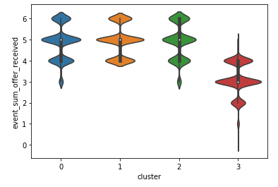
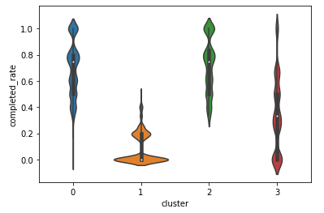

# Starbucks Promotion Analysis
## Table of Contents
1. [Project Motivation](#pd)  
2. [Files](#an) 
3. [Results](#rs) 
4. [Build with](#bw) 
5. [Credits and Acknowledgements](#ca) 

## 1. Project Motivation
In this project, we are using Starbucks real promotions data to try understand customers behavior. As a company, it is important to have an efficient promotional spend that can maximize revenue, while maintaining promotional cost as low as possible. One of the way to achieve the goals is by understanding the customer behavior to know which promotion works for which segment. Creating tailored offering based on specific customer traits will hopefully increase the return in promotional spend.

This particular repository try to cluster the customer based on their behavior to certain promotions and provide recomendation on what other promotion shall be offered to the respective customers.

## 2. Files
Inside Starbucks folder, there are :

- Jupyter notebook that illustrate the analysis, comments, and rationale

- Data folder inside Starbukcs contained these three files:
  - portfolio.json - containing offer ids and meta data about each offer (duration, type, etc.)
  - profile.json - demographic data for each customer
  - transcript.json - records for transactions, offers received, offers viewed, and offers completed
  
- Images folder stored graphic for this repo

## 3. Results
KMeans and PCA were used to build the cluster. As a result,  4 group of customers with a quite differentiated characteristics are identified,

- cluster 0: received a lot of offer but the response was mixed. This group is the one with least gap between male and female.

- cluster 1: received a lot of offer but the response was low, dominated by male whom respond more likely via mobile or web, and relatively ok with lo to med level reward.

- cluster 2: this group receives quite a lot of promotions and also respond to almost all of them. Though still male dominated, this group has least gap between and female indicating sizeable portion of women as compare to the other groups. 

- cluster 3: This group not received as much promotions as other and not completing it as much as well. Uniquely, they seem to be relatively more responsive with high dificulty and high reward promotions. 

## 4. Build with
- Python 3+
- Machine Learning Libraries: NumPy, Pandas, SciKit Learn
- Web App and Data Visualization:Plotly 

## 5. Credits and Acknowledgements
- Udacity for providing such a complete Data Science Nanodegree Program
- Starbucks for providing the datasets
- https://www.shanelynn.ie/summarising-aggregation-and-grouping-data-in-python-pandas/
- https://scikit-learn.org/stable/modules/clustering.html#clustering-performance-evaluation

